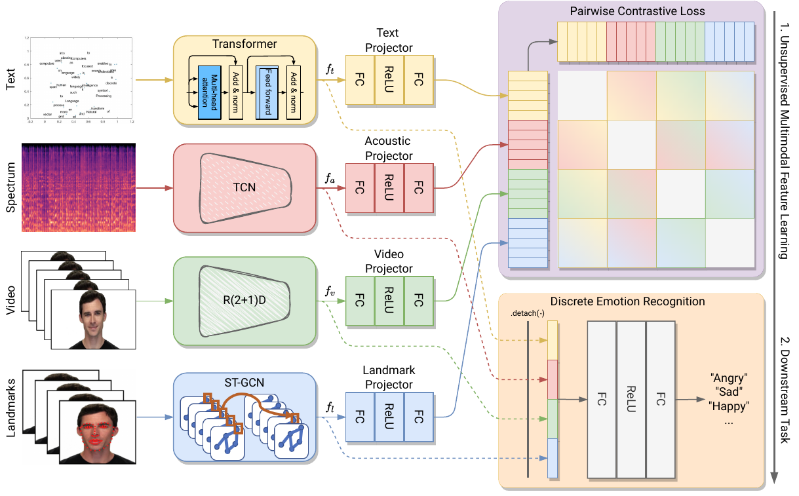

# Multimodal Emotion Recognition with Modality-Pairwise Unsupervised Contrastive Loss

This is the official repository for the paper:


> **Multimodal Emotion Recognition with Modality-Pairwise Unsupervised Contrastive Loss**<br>
> [Riccardo Franceschini](https://scholar.google.com/citations?user=mvse8foAAAAJ&hl=it&oi=ao),[Enrico Fini](https://scholar.google.com/citations?user=OQMtSKIAAAAJ&hl=en),[Cigdem Beyan](https://scholar.google.com/citations?user=VmjUxckAAAAJ&hl=it&oi=ao),[Alessandro Conti](https://www.linkedin.com/in/altndrr/),[Federica Arrigoni](https://scholar.google.com/citations?hl=it&user=bzBtqfQAAAAJ&view_op=list_works&sortby=pubdate),[Elisa Ricci](https://scholar.google.com/citations?user=xf1T870AAAAJ&hl=en)<br>
> **ICPR 2022**

> Paper: [ArXiv]<br>
Official implementation of "Multimodal Emotion Recognition with Modality-Pairwise Unsupervised Contrastive Loss", ICPR2022  

> **Abstract:** Emotion recognition is involved in several real-world applications. With an increase in available modalities, automatic understanding of emotions is being performed more accurately. The success in Multimodal Emotion Recognition (MER), primarily relies on the supervised learning paradigm. However, data annotation is expensive, time-consuming, and as emotion expression and perception depends on several factors (e.g., age, gender, culture) 
obtaining labels with a high reliability is hard. Motivated by these, we focus on unsupervised feature learning for MER. 
%The emotions are represented as discrete categories (such as angry and happy) while as the multimodal data text, acoustic and vision are used. 
We consider discrete emotions, and as modalities text, audio and vision are used.
Our method, as being based on contrastive loss between pairwise modalities, is the first attempt in MER literature. Our end-to-end feature learning approach has several differences (and advantages) compared to existing MER methods: 
i) it is unsupervised, so the learning is lack of data labelling cost; ii) it does not require data spatial augmentation, modality alignment, large number of batch size or epochs; iii) it applies data fusion only at inference; and iv) it does not require backbones pre-trained on emotion recognition task. The experiments on benchmark datasets show that our method outperforms several baseline approaches and unsupervised learning methods applied in MER. %Although performing unsupervised feature learning, 
Particularly, it even surpasses a few supervised MER state-of-the-art.


<br>
<p align="center">
     <br />
    <em>
    A visual comparison of our UNified Objective (UNO) with previous works.
    </em>
</p>
<br>

> **Acknowldgement:**
This work was supported by the EU H2020 [SPRING](https://spring-h2020.eu/) project (No. 871245) and by Fondazione [VRT](https://www.fondazionevrt.it/).

# Installation
Our implementation is based on [PyTorch](https://pytorch.org). Logging is performed using [Wandb](https://wandb.ai/site). We recommend using `conda` to create the environment and install dependencies:
```
conda create --name mpuc-mer python=3.8
conda activate mpuc-mer
conda install pytorch==1.7.1 torchvision==0.8.2 cudatoolkit=XX.X -c pytorch
pip install wandb sklearn tqdm
```
# Datasets
Currently there are implemented and supported to the latest code version
* CMU-MOSEI -> (http://multicomp.cs.cmu.edu/resources/cmu-mosei-dataset/)
* RAVDESS -> (https://smartlaboratory.org/ravdess/)


## How to Run 
To run the code is necessary to pass a configuration file. Two configuration files for the two dataset are available in the config folder. To run the code you can simply use the following command:
```
python main.py --config config/params_RAVDESS.yaml --device cuda:0 --dataset RAVDESS --output /path/to/log/folder  --wandb True
```

An example of a config file for CMU-MOSEI
```
dataset:
    path_train : "/path/to/train"
    path_test : "/path/to/test"
    path_valid : "/path/to/validation"
    n_frames: 30
    classes : 6
    text: True 
    video: True 
    audio: True 
    graph: True 


model_params:
    out_feat: 512
    backbone: "STCGN"
    adj_matr : "/path/to/adj.npy"

training:
    lr_encoder : 0.001
    lr_linear : 0.001
    batch_size : 32    
    scheduler_step :  5
    scheduler_gamma : 0.9    
    wd : 0.001
    momentum : 0.9
    epochs : 2000
    patience : 50
    num_workers : 2
    contrastive: True
    unsupervised: True
```

The model and training sections are common among all the setting while the dataset change depending on the dataset used.

For example in RAVDESS, since the split are not standard it is necessary to specify the split_percentage and if the split has to be performed considering the actor split or not and so on.
```
dataset:
    path : "/path/to/ravdess/"
    path_audio : "/path/to/ravdess_audio"
    n_frames: 90
    n_mels : 128
    classes : 8
    actor_split: True 
    text: False 
    video: False 
    audio: True 
    graph: True 
    split_percentage: 0.9
```


# Citation
If you like our work, please cite our paper:
```
@InProceedings{paper,
    author    = {Riccardo Franceschini, Enrico Fini, Cigdem Beyan, Alessandro Conti, Federica Arrigoni, and Elisa Ricci},
    title     = {Multimodal Emotion Recognition with Modality-Pairwise Unsupervised Contrastive Loss},
    booktitle = {Proceedings of the IAPR International Conference on Pattern Recognition (ICPR)},
    year      = {2022}
}
```